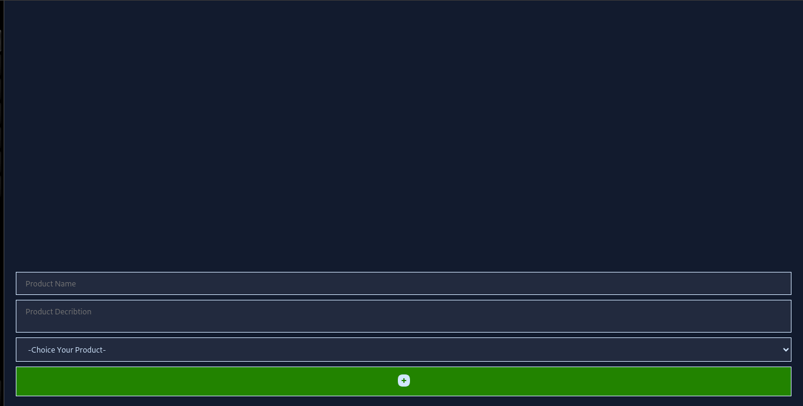
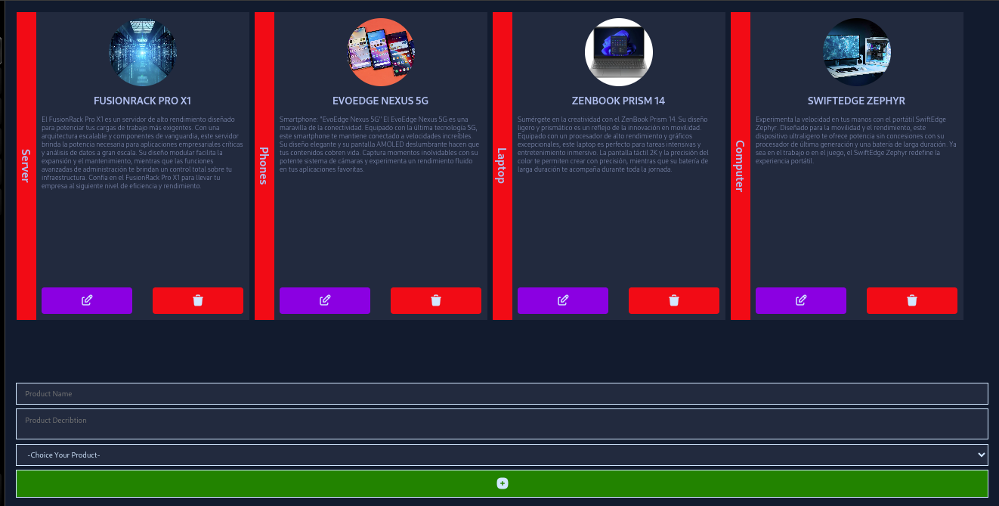

# Svelte Project: Product Card Generator

Project website: https://shiny-tulumba-6cf8cb.netlify.app/

## Features

1. Form with two input fields: product name and product description.
2. Selection of computer materials from a dropdown menu (select).
3. Button to generate a card with the data entered in the form.
4. Each generated card includes options to delete and edit.

## Requirements

Make sure you have Node.js installed on your system.

- How to Start the Project
- Clone this repository: `git clone https://github.com/xabi1000/todo-list-fazt`
- Go to the project directory: cd your-project
- Install dependencies: pnpm install
- Launch the application: pnpm run dev

### Screenshot 1

### Screenshot 2

## Learning and Improvements

This project is an excellent way for me to start with Svelte and expand my frontend development skills. I've been able to explore different functionalities, such as state management, events, and components.

## Future Enhancements Planned:

- Field validation in the form.
- UI/UX improvements in design.
- Persistence of generated cards using local storage.
